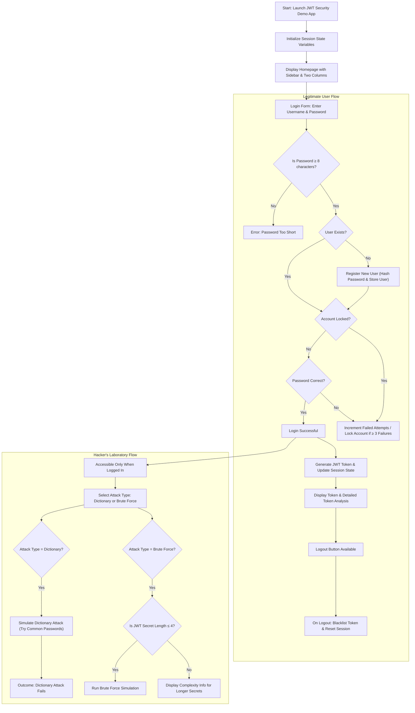

# JWT Security Demo

The JWT Security Demo is an interactive Streamlit application that demonstrates best practices in JWT security, highlights common vulnerabilities, and simulates attack scenarios. It serves both as an educational tool for legitimate users and a sandbox for exploring attack techniques.

[demo.webm](https://github.com/user-attachments/assets/4c760642-46bd-4665-9914-4a9d52f607ba)

---

## Overview

This demo illustrates key aspects of JWT security:
- **User Authentication:**  
  - Registration and login are handled via a form that requires a username and a password (minimum 8 characters).
  - Passwords are hashed using SHA-256 with a random salt.
  - After multiple failed login attempts, the user account is temporarily locked.
- **JWT Token Management:**  
  - Upon successful login, a JWT token is created with standard claims such as `sub` (subject), `exp` (expiration), `iat` (issued at), and `jti` (token identifier).
  - The token is analyzed and its details (header, payload, and signature) are displayed along with security insights.
- **Attack Simulations:**  
  - **Dictionary Attack:** Simulates attempts using common passwords.
  - **Brute Force Attack:** Simulates guessing the JWT secret. For longer secrets (length > 4), the app displays the complexity details rather than running the full simulation.
- **Session and Token Security:**  
  - Uses session state to track the current user and tokens.
  - Supports token blacklisting on logout to prevent token reuse.
- **Educational Resources:**  
  - An expandable section provides additional security best practices and external resources.

The complete application code is available in `jwt_demo.py`.

## User Flow and Application Paths

Below is a Mermaid diagram that illustrates the major decision points and user paths within the application:



## Detailed Walkthrough

1. **Initialization:**
   - The app starts by setting up session state variables such as `logged_in`, `users`, `jwt_secret`, and settings for attack simulations.

2. **User Authentication (Legitimate User Flow):**
   - **Login Form:**  
     - The user is prompted to enter a username and a password.
     - If the password is shorter than 8 characters, an error is displayed.
   - **User Registration:**  
     - If the username is new, the password is hashed (with salt) and the user is registered.
   - **Account Locking:**  
     - If too many failed attempts occur, the account is locked for 5 minutes.
   - **Successful Login:**  
     - When the correct password is provided, a JWT token is created with a set expiration and unique identifier.
     - The token is displayed along with a detailed analysis that breaks down the header, payload, and signature.
   - **Logout:**  
     - The user can log out, which triggers token blacklisting (to prevent token reuse) and resets the session.

3. **Hacker's Laboratory (Attack Simulation):**
   - **Access:**  
     - This section is available only when the user is logged in.
   - **Attack Options:**  
     - **Dictionary Attack:**  
       - The simulation cycles through a list of common passwords and updates progress. It ultimately shows that none of the common passwords match.
     - **Brute Force Attack:**  
       - If the JWT secret is short (4 characters or less), a brute force simulation runs, iterating over all possible combinations.
       - For longer secrets, the app displays information about the secret length, total possible combinations, and an estimated time to crack based on a given attempt rate.

4. **Educational Resources:**
   - An expandable section provides additional details on JWT security best practices, common attack vectors, and links to external resources for further reading.

## Setup and Running the Application
   
**Installation:**

Install the required packages using pip:
```bash
uv pip install -r requirements.txt
```
   
**Running the Application:**
Launch the app by running:
```bash
streamlit run jwt_demo.py
```

